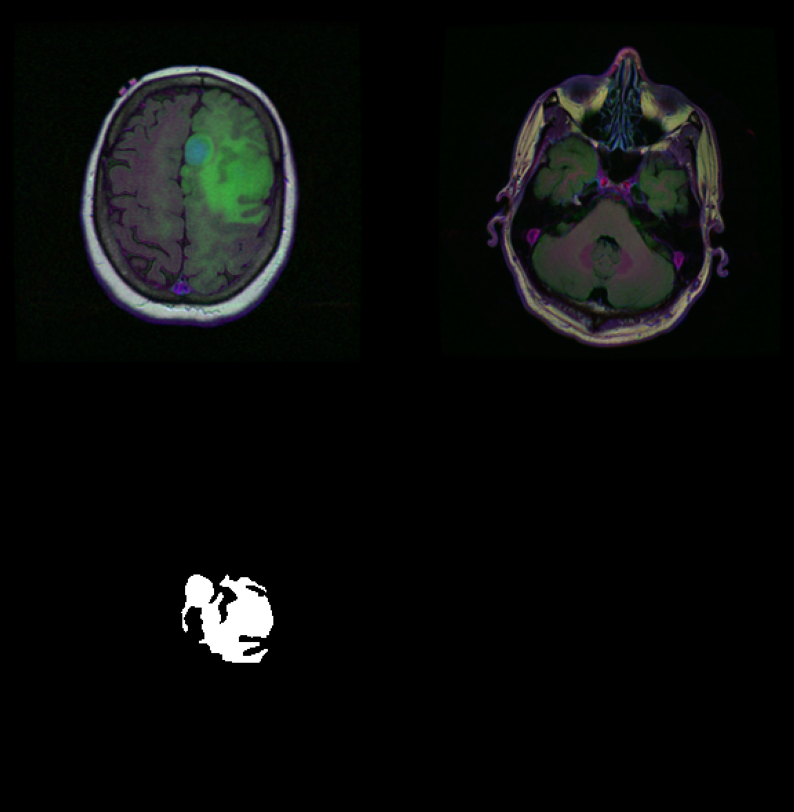

# Generative Medical Image Segmentation

This project aims to use Generative Medical Segmentation (GMS), which leverages a Variational Autoencoder (VAE) to perform medical image segmentation by mapping image latent representations to mask latent representations. This project focuses on masking abnormalities in Brain MRI images, utilizing the Brain MRI segmentation dataset from Kaggle.

**Disclaimer** 
All models from the report can be found in the models folder. They are split into different notebooks as the individually takes a long time to run. 

The folder scripts contains helper functions for training, testing and data loading. These functions is less important to the course goals, and was therefore removed from the notebooks to keep focus on the models.